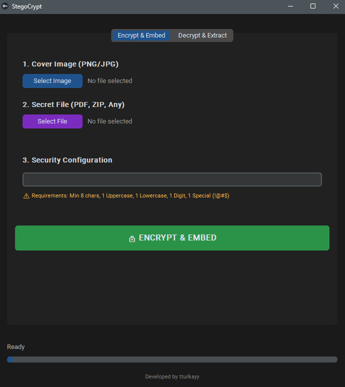
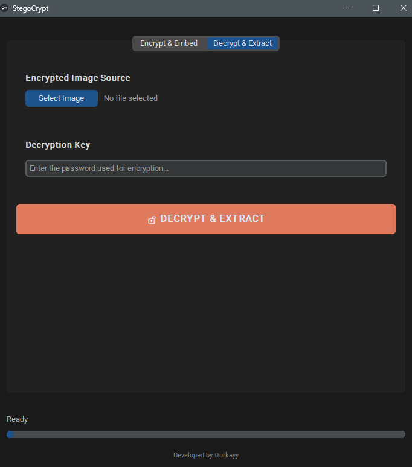

# 🔑 StegoCrypt


**StegoCrypt** is more than just a steganography tool; it is a digital safe designed to protect your privacy. 

It allows you to securely encrypt any file (PDF, ZIP, TXT, etc.) using military-grade **AES-256** encryption and hide it invisibly within the pixels of a standard PNG image using **LSB (Least Significant Bit)** manipulation.

Whether you are a cybersecurity enthusiast, an engineer, or someone who values privacy, StegoCrypt provides a robust "Security through Obscurity" solution.

---

## 🧠 How It Works: The Engineering Behind

StegoCrypt operates on a dual-layer security architecture. It doesn't just hide your file; it locks it in a titanium box before burying it.

### 1. The Cryptography Layer (AES-256)
Before any data touches the image, it goes through a rigorous encryption process:
* **Key Derivation:** Your password is hashed using **SHA-256** to create a 32-byte cryptographic key.
* **Encryption:** The file data, filename, and size are packaged together using a binary `struct` protocol. This package is then encrypted using **AES-256 (CBC Mode)**.
* **Result:** Even if someone extracts the data from the image, they will only see meaningless random noise without your password.

### 2. The Steganography Layer (LSB Manipulation)
This is where the magic happens. The encrypted binary data is injected into the **Least Significant Bits** of the image's pixels.

* **The Logic:** A digital image is made of pixels, and each pixel has Red, Green, and Blue (RGB) values (0-255).
* **The Trick:** Changing a value from `255` (1111111**1**) to `254` (1111111**0**) is invisible to the human eye but perfect for storing binary data.
* **Capacity:** StegoCrypt utilizes all 3 color channels, storing **3 bits of data per pixel**.

```mermaid
graph LR
    subgraph Original_Pixel [Original Pixel]
        direction TB
        A[Red Channel<br>1011001<b>1</b>]
    end
    
    subgraph Secret_Data [Secret Data]
        direction TB
        B[Binary Bit<br><b>0</b>]
    end
    
    subgraph Modified_Pixel [Modified Pixel]
        direction TB
        C[Red Channel<br>1011001<b>0</b>]
    end

    A -->|LSB Replacement| C
    B -->|Inject| C
    C -->|Visual Check| D[No Visible Change 👁️]
    
    %% Stillendirme: Arka plan renkleri + Siyah Yazı (color:#000)
    style A fill:#ff9999,stroke:#333,stroke-width:2px,color:#000
    style B fill:#ffff99,stroke:#333,stroke-width:2px,color:#000
    style C fill:#9999ff,stroke:#333,stroke-width:2px,color:#000
    style D fill:#ffffff,stroke:#333,stroke-width:2px,color:#000,stroke-dasharray: 5 5
 ```
*(Visualization of how bit manipulation works on pixel level)*

---
## 📂 Project Architecture

StegoCrypt is built with a modular approach to ensure maintainability and separation of concerns:

```text
StegoCrypt/
├── main.py              # Entry point of the application
├── gui.py               # Frontend logic (CustomTkinter, Threading)
├── crypto.py            # Backend logic: AES-256 Encryption/Decryption
├── stego.py             # Backend logic: LSB Image Encoding/Decoding
├── version_maker.py     # Utility script for generating Windows version info
├── requirements.txt     # Python dependencies
└── app.ico              # Application icon
```
---

## 🚀 Key Features

* **🛡️ Military-Grade Security:** Data is unreadable without the password, thanks to AES-256.
* **📂 Any File Support:** Embed not just text, but PDF, ZIP, DOCX, or any binary file.
* **🎨 Professional UI:** A sleek, dark-themed interface built with `CustomTkinter` featuring a responsive card layout.
* **⚡ Non-Blocking Performance:** Built on a **multi-threaded** architecture, ensuring the UI remains responsive and provides real-time progress updates during heavy operations.
* **🔧 Smart Optimization:** Optimized algorithms allow processing of high-resolution (4K) images in seconds.
* **🧩 Data Integrity:** Custom binary protocol handles file names and sizes automatically, ensuring flawless extraction.

---

## ▶️ Usage Guide

### 1. Encrypt & Embed
> **Scenario:** You have a confidential PDF contract (`contract.pdf`) and you want to send it safely inside a photo of a landscape.



1.  Launch the application: `python main.py`
2.  **Select Cover Image:** Choose a PNG or JPG image. This will be the "container."
3.  **Select Secret File:** Pick the file you want to hide (e.g., `contract.pdf`).
4.  **Set Password:** Enter a strong password. **Do not forget this!**
5.  **Run:** Click **🔒 ENCRYPT & EMBED**. StegoCrypt will generate a new PNG image. It looks identical to the original, but it holds your secret.

### 2. Decrypt & Extract
> **Scenario:** You received a suspicious-looking PNG image and you have the password.



1.  Switch to the **Decrypt & Extract** tab.
2.  **Select Encrypted Image:** Choose the PNG file created in the previous step.
3.  **Enter Password:** Type the exact password used for encryption.
4.  **Run:** Click **🔓 DECRYPT & EXTRACT**.
5.  **Success:** The tool will extract the hidden data, decrypt it, and save the original `contract.pdf` to your computer.

---
## 📥 Download Executable (No Python Required)

You can download the **.exe** file directly and run it instantly.

> **Latest Version:** v1.0.0 (Official Release)

1.  Click the link below to visit the Releases page.
2.  Download **`StegoCrypt.exe`** from the "Assets" section.
3.  Double-click to run! (Portable app, no installation needed).

**[Download StegoCrypt v1.0.0 Here](https://github.com/tturkayy/StegoCrypt/releases/tag/v1.0.0)**

---

## 🛠️ Installation & Setup

### Prerequisites
* Python 3.8 or higher
* pip (Python Package Installer)

### Quick Start
1.  **Clone the repository:**
    ```bash
    git clone [https://github.com/tturkayy/StegoCrypt.git](https://github.com/tturkayy/StegoCrypt.git)
    cd StegoCrypt
    ```

2.  **Install dependencies:**
    ```bash
    pip install -r requirements.txt
    ```
    *(If you don't have the text file, simply run: `pip install customtkinter pillow pycryptodome`)*

3.  **Run the app:**
    ```bash
    python main.py
    ```

---

## 🏗️ Building Executable (.exe)

Want to run StegoCrypt on a PC without Python? You can build a standalone executable:

1.  Install the builder tools:
    ```bash
    pip install pyinstaller pyinstaller-versionfile
    ```
2.  Generate the executable (Make sure `app.ico` is in the folder):
    ```bash
    pyinstaller --noconsole --onefile --name="StegoCrypt" --icon="app.ico" --add-data "app.ico;." --version-file="file_version_info.txt" --collect-all customtkinter main.py
    ```
3.  Find your app in the `dist/` folder!

---

## 📐 Capacity Calculation: The Math

How do you know if your secret file will fit into a specific image? StegoCrypt uses a deterministic approach based on the image resolution.

Since we utilize the **Least Significant Bit (LSB)** of each color channel (Red, Green, Blue), every single pixel can store **3 bits** of data.

### The Formula
To calculate the maximum byte capacity of an image, use this engineering formula:

$$\text{Capacity (Bytes)} = \frac{\text{Width} \times \text{Height} \times 3}{8}$$

* **Width x Height:** Total pixel count.
* **x 3:** Bits per pixel (R, G, B channels).
* **/ 8:** Converts bits to bytes.

### Real-World Examples
Here is a reference table to help you choose the right cover image:

| Image Resolution | Dimensions | Total Pixels | Max Data Capacity |
| :--- | :--- | :--- | :--- |
| **HD (720p)** | 1280 x 720 | ~0.9 MP | **~345 KB** |
| **Full HD (1080p)** | 1920 x 1080 | ~2.0 MP | **~777 KB** |
| **2K (QHD)** | 2560 x 1440 | ~3.6 MP | **~1.3 MB** |
| **4K (UHD)** | 3840 x 2160 | ~8.3 MP | **~3.1 MB** |

> **Pro Tip:** Always choose an image slightly larger than the required capacity to account for the encryption header and file metadata overhead.

---
## ⚠️ Important Engineering Notes

* **Compression is the Enemy:** Steganography relies on precise pixel values. Services like **WhatsApp, Facebook, or Instagram** compress images, which destroys the LSB data.
    * *Solution:* Always share the output image as a **File/Document** or inside a **ZIP** archive.
* **Capacity Limits:** The cover image must be large enough to hold your data.
    * *Rule of Thumb:* The image file size (PNG) should be approx. **8x larger** than the secret file.

---
## ❓ Troubleshooting

**Q: I forgot my encryption password. Can I recover my file?**
<br>A: **No.** StegoCrypt uses AES-256, which is mathematically impossible to crack within a human lifetime without the key. There is no backdoor.

**Q: The extracted file is corrupted or empty.**
<br>A: This usually happens if the image was compressed (e.g., sent via WhatsApp) or resized. Ensure the image has not been modified after encryption.

**Q: The UI freezes during encryption.**
<br>A: This should not happen as the tool is multi-threaded. If it does, ensure you are not processing a massive file (e.g., >500MB) on a low-RAM machine.

---
## 📄 License

This project is open-source and licensed under the **MIT License**. Feel free to fork, modify, and distribute.

---
## ⚠️ Legal Disclaimer
This tool is designed for educational purposes and legitimate privacy protection only. The developer is not responsible for any misuse of this software for malicious activities.

---
*Developed by Turkay Yildirim*
