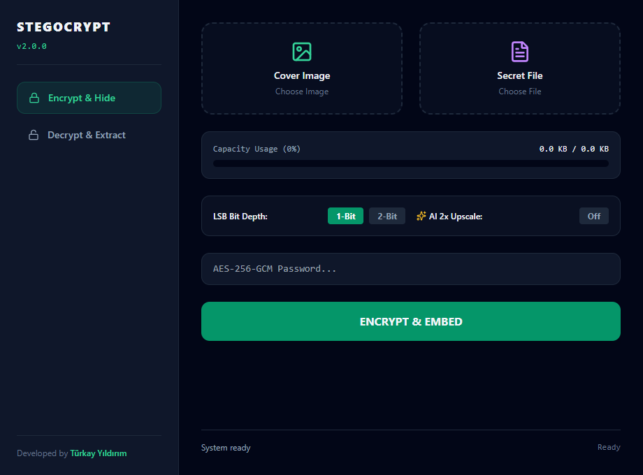

# 🛡️ StegoCrypt v2.0.0

StegoCrypt is a standalone desktop application that combines authenticated cryptography with least-significant-bit (LSB) image steganography. It encrypts arbitrary payloads (documents, archives, binaries, or media) and embeds them directly into the pixel structure of carrier images without perceptible visual distortion.

The application is built on Tauri v2, providing a native Rust-backed desktop runtime with a React/Tailwind front-end and a modular Python cryptographic processing engine.

---

## ⚙️ Architecture & Core Mechanics

    [Input File] ──> [Smart ZSTD] ──> [AES-256-GCM] ──> [LSB Bit Embedder] ──> [Stego PNG]
                                                             │
                                                   [Optional 2x AI Upscale]

### 1. Cryptography & Data Compression
* **Key Derivation:** Generates a 256-bit key via PBKDF2-HMAC-SHA256 using 100,000 iterations and a dynamic 16-byte cryptographic salt.
* **Payload Encryption:** Employs AES-256-GCM (Galois/Counter Mode) with a 12-byte random nonce and 16-byte authentication tag, ensuring both confidentiality and tamper detection.
* **Smart Compression:** Pre-compresses payloads using Zstandard (ZSTD). If a file is already compressed (e.g., ZIP, MP4) and yields negative compression, the engine falls back to raw data to save embedding budget.

### 2. Configurable LSB Steganography
* **1-Bit Depth:** Injects 1 bit per RGB channel (3 bits/pixel) for maximum imperceptibility and noise resistance.
* **2-Bit Depth:** Injects 2 bits per RGB channel (6 bits/pixel) to double embedding capacity on smaller images.
* **AI Super-Resolution:** Integrates an on-demand 2x image upscaler (upscaler.py via ONNX Runtime with Lanczos fallback), increasing total pixel count 4x to accommodate larger payloads.
* **Visual Fidelity Analysis:** Automatically measures and displays real-time PSNR (Peak Signal-to-Noise Ratio) and SSIM (Structural Similarity Index) metrics upon embedding.

---

## 🖼️ Application Interface

---

## 📁 Repository Structure

    StegoCrypt/
    ├── frontend/                     # Tauri v2 Desktop & UI Project
    │   ├── src/                      # React frontend (Vite, Tailwind CSS, Lucide)
    │   │   ├── App.jsx               # Application UI & state management
    │   │   └── App.css               # Global styles and indeterminate loaders
    │   ├── src-tauri/                # Rust Native Runtime & Bridge
    │   │   ├── src/main.rs           # Multi-threaded async engine invoker
    │   │   ├── Cargo.toml            # Rust dependencies & binary targets
    │   │   ├── tauri.conf.json       # Window geometry, permissions & installer config
    │   │   ├── cli_bridge.py         # JSON CLI dispatcher
    │   │   ├── crypto_v2.py          # AES-256-GCM & ZSTD compression module
    │   │   ├── stego_v2.py           # Configurable LSB encoder/decoder
    │   │   ├── quality_metrics.py    # PSNR and SSIM computation module
    │   │   └── upscaler.py           # Super-resolution inference module
    ├── .gitignore
    ├── LICENSE
    └── README.md

---

## 📐 Theoretical Capacity Reference

Net embedding capacity depends on pixel count, selected bit depth, and whether AI 2x scaling is enabled:

    Capacity (Bytes) = [ (Width * Height * 3 * BitDepth) - 40 ] / 8

| Resolution | Dimensions | 1-Bit Mode | 2-Bit Mode | 2-Bit + AI 2x Upscale |
| :--- | :--- | :--- | :--- | :--- |
| **720p (HD)** | 1280 x 720 | ~345 KB | ~691 KB | **~2.76 MB** |
| **1080p (FHD)** | 1920 x 1080 | ~777 KB | ~1.55 MB | **~6.22 MB** |
| **1440p (2K)** | 2560 x 1440 | ~1.38 MB | ~2.76 MB | **~11.05 MB** |
| **2160p (4K)** | 3840 x 2160 | ~3.11 MB | ~6.22 MB | **~24.88 MB** |

---

## 🛠️ Building from Source

### Prerequisites
* Node.js (v18+)
* Rust & Cargo (latest stable)
* Python (3.10+)

### Setup & Compilation

    # 1. Clone repository
    git clone [https://github.com/tturkayy/StegoCrypt.git](https://github.com/tturkayy/StegoCrypt.git)
    cd StegoCrypt\frontend

    # 2. Install UI dependencies
    npm install

    # 3. Build standalone Windows installer (.msi & setup.exe)
    npm run tauri build

The compiled binaries will be located inside `frontend/src-tauri/target/release/bundle/nsis/`.

---

## ⚠️ Notes on Steganographic Preservation

* **Lossless Transport Required:** LSB steganography modifies exact byte values in image channels. Transmitting the stego image through platforms that re-encode or compress photos (WhatsApp, Telegram photo mode, Discord, Instagram) will permanently destroy the payload.
* **Transmission:** Always share output images as **uncompressed files/documents** or enclosed inside a `.zip` archive.

---

## 📄 License & Disclaimer

This project is licensed under the MIT License.

    This tool is designed for educational purposes and legitimate privacy protection only. 
    The developer is not responsible for any misuse of this software for malicious activities.

Developed by [Türkay Yıldırım](https://github.com/tturkayy)